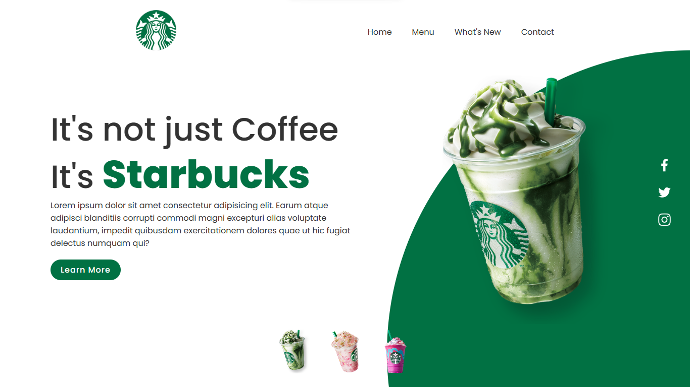

# Starbucks Landing Page

Landing Page do website da Starbucks

## Home



## 🚀 Começando


### 📋 Pré-requisitos


```
Ter o Node.js instalado em sua máquina.
```

### 🔧 Instalação

```
Obter o link do repositório do git
```

```
Em seu terminal de comando, executar ** git clone (url do projeto) **
```


## 🛠️ Construído com

* [HTML](https://www.w3schools.com/html/) - Linguagem de Marcação
* [CSS](https://developer.mozilla.org/en-US/docs/web/css) - Linguagem de Estilização
* [JavaScript](https://developer.mozilla.org/pt-BR/docs/Learn/JavaScript) - Linguagem de Programação para web

## ✒️ Autores

* **Desenvolvedor FullStack** - [Pedro Henrique](https://github.com/eupedrohenrique)
